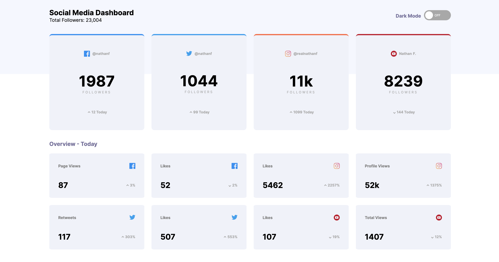

# Social media dashboard with theme switcher solution

I created this dashboard as a practice project to further develop my CSS Grid, Flexbox and JavaScript skills. This code is the solution to one of the challenges developed by frontendmentor.io. They provided the raw materials, such as the text and the images. I did all of the codework.

## Table of contents

- [Overview](#overview)
  - [The challenge](#the-challenge)
  - [Screenshot](#screenshot)
  - [Links](#links)
- [My process](#my-process)
  - [Built with](#built-with)
  - [What I learned](#what-i-learned)
  - [Continued development](#continued-development)
  - [Useful resources](#useful-resources)
- [Author](#author)
- [Acknowledgments](#acknowledgments)

## Overview

### The challenge

My challenge was to:

- View the optimal layout for the site depending on their device's screen size
- See hover states for all interactive elements on the page
- Toggle color theme to their preference

### Screenshot

### Links

- Live Site URL: (https://hermanvulkers.github.io/social-media-dashboard/)

## My process

### Built with

- Semantic HTML5 markup
- CSS Grid
- Flexbox
- JavaScript

### What I learned

Through building this dashboard, I got a more solid understanding of the different CSS Grid properties. I also got a deeper understanding of media queries due to the need to make the website responsive to mobile.

### Useful resources

- [Example resource 1](https://www.example.com) - This helped me for XYZ reason. I really liked this pattern and will use it going forward.
- [Example resource 2](https://www.example.com) - This is an amazing article which helped me finally understand XYZ. I'd recommend it to anyone still learning this concept.

**Note: Delete this note and replace the list above with resources that helped you during the challenge. These could come in handy for anyone viewing your solution or for yourself when you look back on this project in the future.**

## Author

- Website - [Herman Vulkers](https://www.hermanvulkers.com)
- Frontend Mentor - [@yourusername](https://www.frontendmentor.io/profile/yourusername)

## Acknowledgments

This is where you can give a hat tip to anyone who helped you out on this project. Perhaps you worked in a team or got some inspiration from someone else's solution. This is the perfect place to give them some credit.

**Note: Delete this note and edit this section's content as necessary. If you completed this challenge by yourself, feel free to delete this section entirely.**
